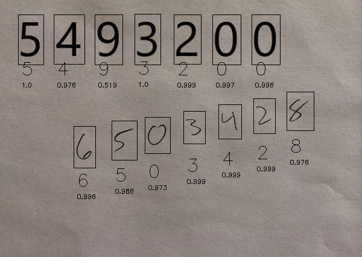
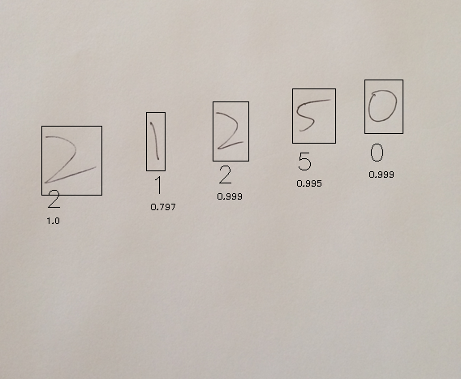
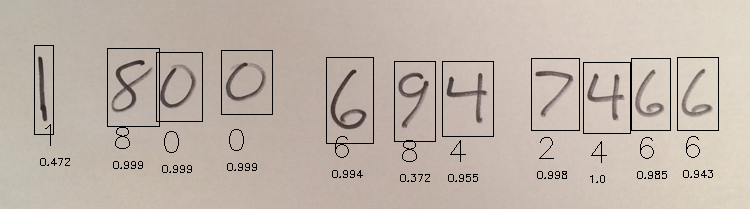

# Digit-Recognition
1.	Dataset:-

a) In this project, the MINST dataset is used for training & testing the model. 

b) The dataset is comprised of 60,000 training samples and 10,000 testing samples which have 28x28 image size.

2.	Algorithm:-

a)  In this project, deep learning algorithm CNN (Convolutional Neural Network) is used for building the network and I get 99.43% accuracy in 15 epochs.

b)  ReLu & SoftMax activation function are use.

3.	About:-

a)  In this OpenCV is used for making it a real-time digit detection system through a webcam. 

b)  It can easily detect multiple digits by making a rectangle over every digit with predicting value.

     
    

     

